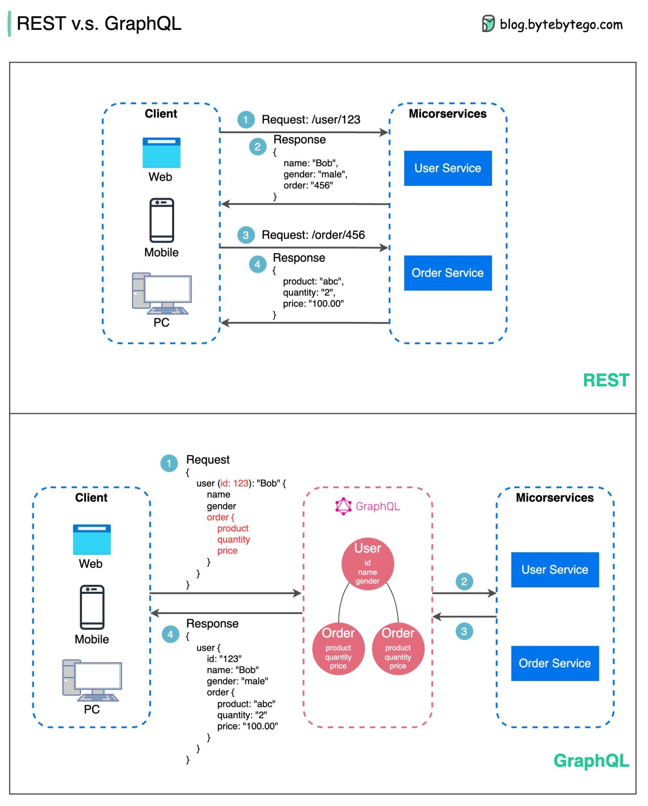

# studyGroup
Pomodoro Study Group

## 000. Week0 Summary
**Meeting Date/Time:** 10/09/2022

**Shared Speakers:**

**Attendees:** Chloe, Dark Knight, Fan, hahaguaa, infrared628, Karen, L.yufan, LiuXueying, Ming, Shenhai , Sunday, V, Whisky, JY, Christine

**Meeting Notes:**

*

## 001. Week1 Summary
**Meeting Date/Time:** 10/28/2022

**Shared Speakers:**

**Attendees:** haguagua, Sophie, Chloe, infrared628, Shenhai 

**Meeting Notes:**
* 分享《向上管理-如何正确汇报工作》读后感 - 上
* 了解leader的特征
* 多汇报
* 汇报的方式

## 002. Week2 Summary
**Meeting Date/Time:** 11/04/2022

**Shared Speakers:**

**Attendees:** haguagua, Liu Xueying, Sophie, Yating, infrared628, Ming

**Meeting Notes:**
* WebAssembly
* Small Talk读书111
* 
## 003. Week3 Summary
**Meeting Date/Time:** 11/18/2022

**Shared Speakers:**

**Attendees:** haguagua, Liu Xueying, Sophie, infrared628

**Meeting Notes:**
* Sophie分享Meta的裁员事件
* Idempotency
* English 10 phrase:
   * The United States is a **sports-minded** country, with millions of fans who follow football, baseball, basketball and hockey, among other sports.
   * The difference between **proactive** people and **reactive** people is that proactive people take initiative, and they come up with ideas to get things done despite the conditions they are in. Reactive people, on the other hand, usually are the ones to react to a situation rather than take initiative to create a situation.
   * Don’t **jump to** conclusions! Perhaps it was his daughter he was dancing with.
   * The workers **approached** the manager with a request for shorter working hours.
   * His sober **approach to** the crisis averted a catastrophe.
   * They **take the time** to understand how the business works, how the product fits in, and what its goals are.
   * You need to work hard—opportunities don’t just come out of **thin air**.
   * He is **empathetic** with the jobless youth, as he was also struggling for a job in his early years.
   * Social media technologies have given companies **access to** an unprecedented flood of new analytics, metrics and user data.
   * Steve Jobs was a gifted **communicator**, and he used this skill to capture the attention of millions.

## 004. Week4 Summary
**Meeting Date/Time:** 12/02/2022

**Shared Speakers:**

**Attendees:** Sophie, Haguagua, Ming, infrared628

**Meeting Notes:**
* Rest vs GraphSL

* 间歇性努力，持续性颓废
  * 断层式努力
  * 原因？意志力不足？意志力 - 心理学上的一个概念，指一个人**自觉确定目标**，并**根据目标来支配行动**，**克服困难实现目标**的品质。
  * 尝试，1）确定目标 - 焦点，白象效应；2）根据目标支配行动 - 开黑，看书；3）克服困难实现目标 - 二十英里法则；
  * ==============================================================================================
  * 1）目标是具体可行的，才能拆解成分阶段的小目标，逐个落地最终达成；eg，上班；2）提高“不应该做的事”的成本，降低“应该做的事”的成本；eg，熬夜，量化vs看两页书，简单到不可能失败的自我管理法则；3）积极反馈，奖励，坚持

* English 10 phrase:
   * Apple will unveil a 10-inch touchscreen tablet device in January, and **ship** the product in March.
   * We define an iteration as a phase or a **milestone**.
   * Her husband was unsympathetic and she felt she had no one to **turn to**.
   * Steve Jobs was a gifted **communicator**, and he used this skill to capture the attention of millions.
   * Life is full of **trade-offs**. You cannot have your cake and eat it too.
   * Point Break was a **breakout** film for Kathryn Bigelow in 1991.
   * I have **little** knowledge of computer and business, can I still learn Dynamics NAV？
   * I was **juggling** books, shopping bags and the baby.
   * I’ve always felt that tragedy and comedy are **two sides** of the same coin. Love and hate are the **opposite sides** of the same coin.
   * My computer keeps going **funny**.

## 005. Week5 Summary
**Meeting Date/Time:** 12/09/2022

**Shared Speakers:**

**Attendees:** Liu Xueying, Haguagua, Ming, infrared628

**Meeting Notes:**

### Prior knowledge

[Activating Prior Knowledge With English Language Learners](https://blog.pragmaticengineer.com/the-product-minded-engineer/?utm_source=wanqu.co&utm_campaign=Wanqu+Daily&utm_medium=website)
* K-W-L Charts (What I Know, What I Want to Know, What I Learned)
* Anticipation Guides (What I Think I Know, What I Think I Want to Know, What I Think I Learned)

[The Product-Minded Software Engineer](https://blog.pragmaticengineer.com/the-product-minded-engineer/?utm_source=wanqu.co&utm_campaign=Wanqu+Daily&utm_medium=website)
* Product-Minded Engineer
  1. Proactive with product ideas/opinions 
  2. Interest in the business, user behavior and data on this
  3. Curiosity and a keen interest in "why?"
  4. Strong communicators and great relationships with non-engineers
  5. Offering product/engineering tradeoffs upfront
  6. Pragmatic handling of edge cases
  7. Quick product validation cycles
  8. End-to-end product feature ownership
  9. Strong product instincts through repeated cycles of learning

* Two dozen states have asked the D.C. Circuit to block a new **climate-change-minded** federal law that they say will inflate electricity bills for families.
* They are **business-minded** yet warm-hearted when it comes to those less fortunate, and prove that they can transform their theoretical academic knowledge into sustainable business practices through social projects.

[copilot](https://github.com/features/copilot)

## 006. Week6 Summary
**Meeting Date/Time:** 12/16/2022

**Shared Speakers:**

**Attendees:** Sophie, Haguagua, infrared628

**Meeting Notes:**
* AWS IAM
  * IAM Policies; IAM user; IAM group; IAM role (temporary role)
  * PPT: https://docs.google.com/presentation/d/1eSO8NhIS7aHG5lYBv6TV0t7HzFxRAWqDb3CpoPXCAQE/edit#slide=id.p
* English : empathy 和 sympathy 的区别
  * empathy: 感同身受, an individual’s ability to understand what another person is going through, by perceiving himself in the same situation，指一个人通过把自己放到相同的情境中感知自己，来理解另一个人正在经历的事情的能力。而有时候我们说“共情”，是强调“理解、共鸣”的意思。
    * He is empathetic with the jobless youth, as he was also struggling for a job in his early years.
    * She is empathetic with the poor, as she was also poor in her childhood.
  * sympathy: "同情"，有同情心，指“对另一个人造成的困难、问题和痛苦感到悲伤或怜悯”，更强调“同情、悲悯”。能够体会别人的痛苦，但是不一定能够理解别人的感受, the feeling of sorrow for the hardships, problems and pain caused to another person，
    I have empathy for the homeless, but I don't have sympathy for them.
    * All Tony’s friends joined in sending their sympathies to his widow Jean.

## 007. Week7 Summary
**Meeting Date/Time:** 12/16/2022

**Shared Speakers:**

**Attendees:** Liu Xueying, Haguagua, Ming, infrared628

**Meeting Notes:**
* English 10 phrase:
  * You are strongly encouraged to save your document frequently, back-up regularly, and print your **work-in-progress** periodically.
  * What Jock had done was **beyond** my comprehension.
  * Major breakthroughs have been made in the reform of China’s **ownership** structure.
  * They bring suggestions and tradeoffs to the table, some of which are included in the revised **spec**.
  * After each project, their product understanding **deepens**, and they start to develop better and better product **instincts**.
  * Children do not know by **instinct** the difference between right and wrong.
  * Tell us what you **bring to the table**, not just what you want.
  * I’ve delivered the cash as you instructed. Now you must **live up** to your end of the bargain!
  * I don’t see the **relevance** of your question.
  * All happy families resemble one another, each unhappy family is unhappy in its own way.

